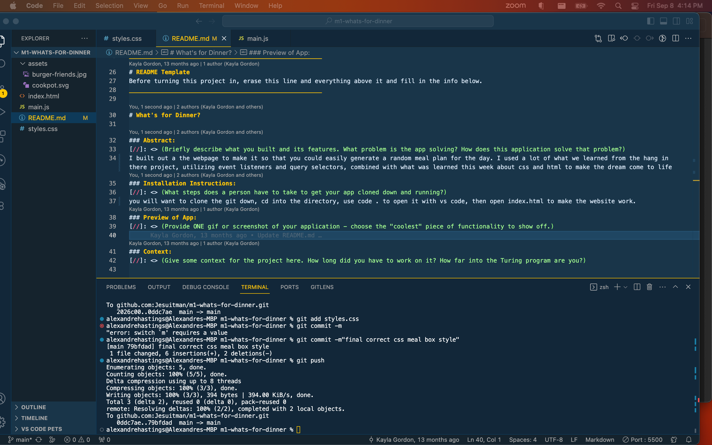

# What's for Dinner?

## Overview

What's for dinner? The ultimate question. You will be building an app that helps users choose a recipe and put together meals. 

This Solo Challenge gives students and instructors the opportunity to get a pulse on where you are with the foundational concepts of Module 1 curriculum. Students should use this as an opportunity to challenge themselves and work completely independently. Google can (and probably should!) be used, but any other code base should not be referenced. Instructors will be able to use your work, both completion of functionality and code quality, to determine where you stand and if you are behind for this point in the module, provide supports to intervene.

The spec for this project can be found [here](https://frontend.turing.edu/projects/module-1/dinner.html). 

## Learning Goals

- Gain experience building an application that utilizes HTML, CSS and JavaScript
- Write HTML and CSS to match a provided comp
- Understand how to listen to and respond to user events
- Individualize your programming skill set

## Setup

- Fork this project to your own Github account
- Clone the repository to your local machine
- `cd` into the project
- Read this README thoroughly, then begin working!

______________________________________________________  
# README Template  
Before turning this project in, erase this line and everything above it and fill in the info below.  
______________________________________________________  

# What's for Dinner? 

### Abstract:
[//]: <> (Briefly describe what you built and its features. What problem is the app solving? How does this application solve that problem?)
I built out a the webpage to make it so that you could easily generate a random meal plan for the day. I used a lot of what we learned from the hang in there project, utilizing event listeners and query selectors, combined with what was learned this week about css and html to make the dream come to life
### Installation Instructions:
[//]: <> (What steps does a person have to take to get your app cloned down and running?)
you will want to clone the git down, cd into the directory, use code . to open it with vs code, then open index.html to make the website work.
### Preview of App:
[//]: <> (Provide ONE gif or screenshot of your application - choose the "coolest" piece of functionality to show off.)

### Context:
[//]: <> (Give some context for the project here. How long did you have to work on it? How far into the Turing program are you?)
I worked on this project a little more sporadically, deciding to make new functionality as soon as I was learning it in class rather than pumping everything out as fast as possible. im in week 3 of mod 1. i feel like this set a very good pace for me
### Contributors:
[//]: <> (Who worked on this application? Link to their GitHubs.)
just me!
### Learning Goals:
[//]: <> (What were the learning goals of this project? What tech did you work with?)
learning goals for this project were to use css as well as html to make a fully function website. a new pice of tech i worked with was radio buttons
### Wins + Challenges:
[//]: <> (What are 2-3 wins you have from this project? What were some challenges you faced - and how did you get over them?)
the biggest win i had was building out the functionality for the radio buttons because i had no idea how to build it, but i felt very accomplished when i did!
